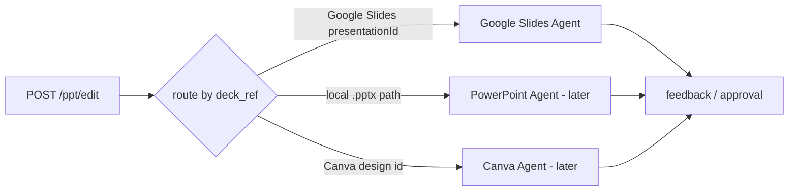
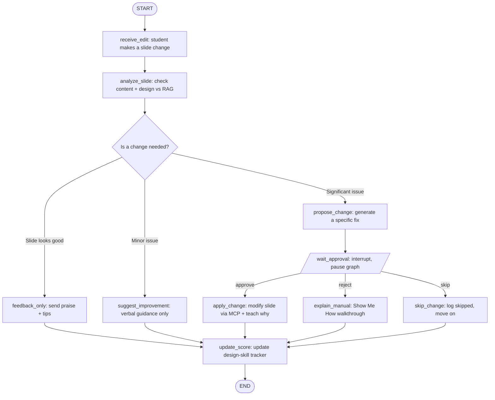
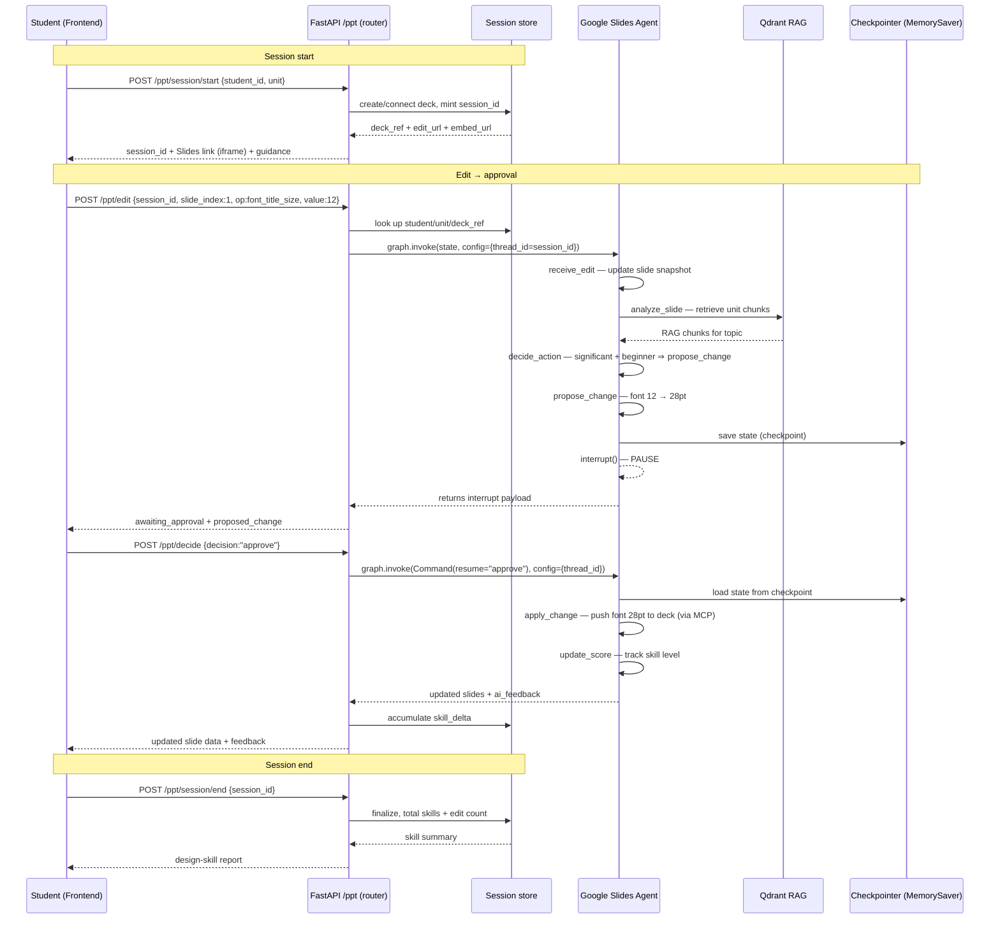
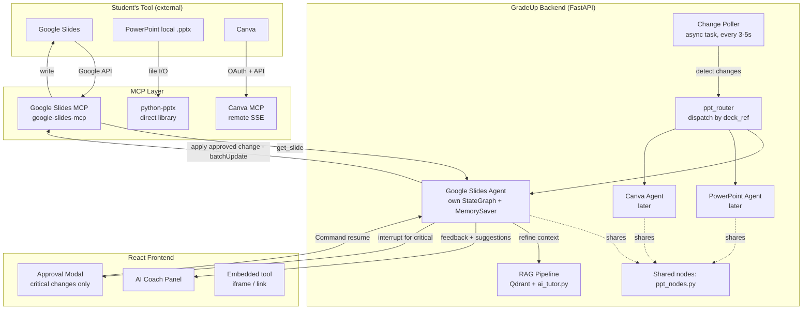

# Seminar PPT Preparation Automation — Implementation Plan

An AI co-pilot that **guides a student to prepare their seminar PPT**. The student edits
slides in Google Slides (or PowerPoint / Canva); a LangGraph agent watches each change,
checks it against unit content in Qdrant (RAG), and either praises it, gives verbal tips,
or proposes a concrete fix. Critical fixes pause the graph and wait for the student's
approval (human-in-the-loop) before the MCP layer applies the edit to the real deck.

This plan reproduces the three board diagrams (graph flow, sequence, MCP architecture) and
maps every piece onto the existing `gradeup_python_2.0` codebase.

---

## 1. How this fits the existing repo

| Board concept | Existing building block in this repo | New file to add |
|---|---|---|
| Router / dispatcher | new — picks the tool-specific agent by `deck_ref` | `ppt_router.py` |
| **Google Slides Agent** (separate agent) | `StateGraph` pattern in [extraction_verification_graph.py](extraction_verification_graph.py) | `agents/google_slides_agent.py` |
| PowerPoint / Canva agents (later) | same shared node library | `agents/pptx_agent.py`, `agents/canva_agent.py` |
| Shared node logic (analyze, propose, score) | reused by every tool agent | `ppt_nodes.py` |
| RAG Pipeline (Qdrant + `ai_tutor.py`) | [`search_qdrant()`](qdrant_integration.py:893) | reuse as-is |
| FastAPI `/ppt/edit`, `/ppt/decide` | seminar endpoints at [app.py:3166](app.py:3166) | add routes in `app.py` |
| Checkpointer (MemorySaver) | new — LangGraph `MemorySaver` + `interrupt()` | in each agent |
| Google Slides MCP / apply layer | `google-slides-mcp` (3rd-party Slides API) | `mcp_slides_client.py` |
| Seminar domain logic (units, scoring) | [seminar_engine.py](seminar_engine.py) | reuse for skill tracking |

> **Design decision:** each editing tool gets its **own agent** (its own compiled `StateGraph`),
> not one tool-agnostic graph. A thin router dispatches to the right agent based on the deck type.
> Google Slides is the first dedicated agent. All agents share the same node library
> (`ppt_nodes.py`) — only the "apply change" / "read slide" tool bindings differ. This keeps the
> Google Slides API (`batchUpdate`) fully isolated from the python-pptx and Canva code paths.

**New dependencies** (add to `requirements.txt`):

```
langgraph>=0.2.0            # StateGraph is already used; pin it explicitly
langchain-mcp-adapters>=0.1 # MultiServerMCPClient for the MCP layer
google-api-python-client    # Google Slides 3rd-party API
google-auth-oauthlib        # OAuth for Slides
```

> Note: the existing graphs (`extraction_verification_graph.py`) import `langgraph` but it is
> not pinned in `requirements.txt` — pin it while you are here.

---

## 2. Graph flow — the Google Slides Agent

This is board diagram #1, encoded as the **Google Slides Agent's** compiled graph. Node names
match the board labels. Every tool agent (Google Slides now; PowerPoint / Canva later) has this
*same* node topology — they differ only in the tool binding used by `receive_edit` (read slide)
and `apply_change` (write slide). The router (§2a) sits in front and picks the agent.

### 2a. Router (dispatches to the tool-specific agent)



```python
# ppt_router.py
def pick_agent(deck_ref: str):
    if deck_ref.startswith("gslides:"):          # Google Slides presentationId
        from agents.google_slides_agent import build_google_slides_agent
        return build_google_slides_agent()
    # future: pptx / canva
    raise ValueError(f"No agent for deck_ref: {deck_ref}")
```

### 2b. Inside the Google Slides Agent



### State schema

Follow the `TypedDict` convention from [extraction_verification_graph.py:128](extraction_verification_graph.py:128):

```python
from typing import TypedDict, List, Dict, Any, Optional, Literal

class PPTAgentState(TypedDict):
    # ── identity / routing ────────────────────────────────
    session_id: str
    student_id: str
    unit: int                       # which seminar unit the deck covers
    deck_ref: str                   # Google Slides presentationId (or local .pptx path)
    slide_index: int

    # ── the incoming edit ─────────────────────────────────
    edit: Dict[str, Any]            # {"op": "font_title_size", "value": 12, "text": "..."}
    slide_snapshot: Dict[str, Any]  # current slide text + design pulled from MCP

    # ── analysis output ───────────────────────────────────
    rag_chunks: List[Dict[str, Any]]        # from search_qdrant()
    severity: Literal["good", "minor", "significant"]
    analysis: str                            # LLM reasoning

    # ── proposal / HITL ───────────────────────────────────
    proposed_change: Optional[Dict[str, Any]]   # concrete MCP op to apply
    decision: Optional[Literal["approve", "reject", "skip"]]

    # ── outputs ───────────────────────────────────────────
    ai_feedback: str
    skill_delta: Dict[str, float]   # {"design": +0.1, "content_depth": +0.2}
    status: str
```

### Node responsibilities

| Node | Does | Calls |
|---|---|---|
| `receive_edit` | Normalize the incoming edit, pull the current slide snapshot | MCP `get_slide` |
| `analyze_slide` | RAG-check content correctness + heuristic design checks (font size, bullet count, contrast) | [`search_qdrant()`](qdrant_integration.py:893) + LLM |
| `decide_action` (conditional) | Route on `severity` → good / minor / significant | — |
| `feedback_only` | Compose praise + 1–2 tips | LLM |
| `suggest_improvement` | Verbal-only guidance, no deck mutation | LLM |
| `propose_change` | Produce a concrete MCP op (`proposed_change`) | LLM |
| `wait_approval` | `interrupt()` — pause and surface the proposal to the frontend | LangGraph `interrupt` |
| `apply_change` | Apply the approved op to the real deck, explain the "why" | MCP `update_*` |
| `explain_manual` | "Show Me How" step-by-step so the student edits it themselves | LLM |
| `skip_change` | Record that the student skipped; no deck change | — |
| `update_score` | Update the design-skill tracker (reuse seminar scoring) | [seminar_engine.py](seminar_engine.py) |

### Wiring — `agents/google_slides_agent.py` (matches the repo's `add_conditional_edges` style)

The nodes come from the shared `ppt_nodes.py`; only `receive_edit` and `apply_change` are bound to
the Google Slides tools. A PowerPoint agent later reuses the same builder with pptx-bound versions.

```python
from langgraph.graph import StateGraph, END
from langgraph.checkpoint.memory import MemorySaver
from ppt_nodes import (analyze_slide_node, feedback_only_node, suggest_improvement_node,
                       propose_change_node, wait_approval_node, explain_manual_node,
                       skip_change_node, update_score_node, route_severity, route_decision)
from agents.google_slides_agent_nodes import receive_edit_node, apply_change_node  # Slides-bound

def build_google_slides_agent():
    g = StateGraph(PPTAgentState)

    g.add_node("receive_edit",        receive_edit_node)
    g.add_node("analyze_slide",       analyze_slide_node)
    g.add_node("feedback_only",       feedback_only_node)
    g.add_node("suggest_improvement", suggest_improvement_node)
    g.add_node("propose_change",      propose_change_node)
    g.add_node("wait_approval",       wait_approval_node)   # contains interrupt()
    g.add_node("apply_change",        apply_change_node)
    g.add_node("explain_manual",      explain_manual_node)
    g.add_node("skip_change",         skip_change_node)
    g.add_node("update_score",        update_score_node)

    g.set_entry_point("receive_edit")
    g.add_edge("receive_edit", "analyze_slide")

    g.add_conditional_edges("analyze_slide", route_severity, {
        "good":        "feedback_only",
        "minor":       "suggest_improvement",
        "significant": "propose_change",
    })

    g.add_edge("propose_change", "wait_approval")
    g.add_conditional_edges("wait_approval", route_decision, {
        "approve": "apply_change",
        "reject":  "explain_manual",
        "skip":    "skip_change",
    })

    for n in ["feedback_only", "suggest_improvement",
              "apply_change", "explain_manual", "skip_change"]:
        g.add_edge(n, "update_score")
    g.add_edge("update_score", END)

    return g.compile(checkpointer=MemorySaver())   # checkpointer enables interrupt/resume
```

---

## 3. Sequence diagram (request lifecycle)

This is board diagram #2 — the full session: **start** (deck link) → the two-call approval flow
(`/ppt/edit` pauses, `/ppt/decide` resumes) → **end** (skill summary).



**Key mechanics**

- `thread_id` (e.g. `session_id`) is the checkpoint key — the two HTTP calls hit the *same* graph run.
- `interrupt()` inside `wait_approval` returns control to FastAPI without ending the run; `MemorySaver` holds the paused state.
- Resume with `graph.invoke(Command(resume=decision), config)`.
- "good"/"minor" paths never interrupt — they run straight to `update_score` and return in one call.

---

## 4. MCP architecture (edit-application layer)

This is board diagram #3. The graph decides *what* to change; the MCP layer decides *how* to
apply it to whichever tool the student uses. This keeps the graph tool-agnostic.



**Tools exposed to the Google Slides Agent** (`update_text`, `update_font`, `add_slide`,
`get_slide`) via the Google Slides MCP server in a new `mcp_slides_client.py`. This client belongs
to the Google Slides Agent only — the PowerPoint agent will have its own `pptx` client, Canva its own.

```python
# mcp_slides_client.py  (sketch) — Google Slides Agent's tool binding
from langchain_mcp_adapters.client import MultiServerMCPClient

def get_google_slides_tools():
    client = MultiServerMCPClient({
        "google_slides": {
            "command": "npx",
            "args": ["-y", "@matteoantoci/google-slides-mcp"],
            "transport": "stdio",
        },
    })
    return client   # agent's receive_edit/apply_change nodes call get_slide / batchUpdate ops
```

Google Slides via **3rd-party API** (as requested): the `google-slides-mcp` server wraps the
Slides REST API (`presentations.batchUpdate`), so the graph's `apply_change` op becomes a
`batchUpdate` request (e.g. `updateTextStyle` for a font size change). OAuth scope needed:
`https://www.googleapis.com/auth/presentations`.

---

## 5. FastAPI endpoints (add to `app.py`)

Mirror the seminar route style at [app.py:3166](app.py:3166). Five endpoints, session-scoped:

| Endpoint | Purpose |
|---|---|
| `POST /ppt/session/start` | Create/connect the deck, return its **edit link + embed URL**, wire it to the agent. Returns `session_id`. |
| `POST /ppt/suggest` | Student **asks** about a slide (optional `query`) → agent says suggested points. Verbal only, never edits the deck. |
| `POST /ppt/edit` | A student **change** on a slide → automatic design/formatting review (minor = verbal tip, major = approval pop-up). |
| `POST /ppt/decide` | Resume a paused run with `approve` / `reject` / `skip` (the pop-up decision). |
| `POST /ppt/session/end` | Finalize; return accumulated design-skill totals + edit count. |

**Triggering `/ppt/edit` (how we know a slide changed):** either the frontend calls it on each
student change (passing `edit`), or a background **change-poller** (M5) reads the deck every 3–5s,
diffs it against the last snapshot, and calls `/ppt/edit` for each changed slide. `/ppt/suggest` is
always student-initiated.

**Session lifecycle** (see [ppt_session.py](ppt_session.py)): `start` mints a `session_id`, creates a
new Google Slides deck (or connects to the student's existing one), and returns
`https://docs.google.com/presentation/d/<id>/edit` + an `/embed` URL the frontend iframes. The
`session_id` is also the LangGraph `thread_id`, so identity (student, unit, deck_ref) is stored once
at start — `/ppt/edit` and `/ppt/decide` only carry the change/decision. Each edit's `skill_delta`
accumulates into the session; `end` returns the totals. *(M1: deck creation is stubbed; the real
`presentations.create` + embed link land in M3.)*

```python
# ── PPT preparation co-pilot ──────────────────────────────

```python
# ── PPT preparation co-pilot ──────────────────────────────
# One compiled agent per tool, cached. The router picks by deck_ref.
_PPT_AGENTS: dict = {}
def _ppt_agent(deck_ref: str):
    from ppt_router import pick_agent
    key = deck_ref.split(":", 1)[0]          # "gslides" | "pptx" | "canva"
    if key not in _PPT_AGENTS:
        _PPT_AGENTS[key] = pick_agent(deck_ref)   # e.g. build_google_slides_agent()
    return _PPT_AGENTS[key]

@app.post("/ppt/edit")
def ppt_edit(req: PPTEditRequest):
    """Student made a slide change → run the tool-specific agent. May pause for approval."""
    cfg = {"configurable": {"thread_id": req.session_id}}
    state = {
        "session_id": req.session_id, "student_id": req.student_id,
        "unit": req.unit, "deck_ref": req.deck_ref,
        "slide_index": req.slide_index, "edit": req.edit,
    }
    result = _ppt_agent(req.deck_ref).invoke(state, cfg)
    if "__interrupt__" in result:          # graph paused at wait_approval
        return {"status": "awaiting_approval",
                "proposed_change": result["__interrupt__"][0].value}
    return {"status": "done", "ai_feedback": result["ai_feedback"], ...}

@app.post("/ppt/decide")
def ppt_decide(req: PPTDecideRequest):     # decision: approve | reject | skip
    """Resume a paused run with the student's decision. Same agent = same thread."""
    from langgraph.types import Command
    cfg = {"configurable": {"thread_id": req.session_id}}
    result = _ppt_agent(req.deck_ref).invoke(Command(resume=req.decision), cfg)
    return {"status": "done", "ai_feedback": result["ai_feedback"], ...}
```

> `/ppt/decide` must carry `deck_ref` too so the router resumes the *same* agent that paused — the
> checkpoint lives inside that agent's `MemorySaver`.

Add Pydantic request models next to the existing `SeminarRespondRequest` etc.

---

## 6. Build order (milestones)

1. **M1 — Session lifecycle + Google Slides Agent skeleton (no MCP, no RAG). ✅ DONE.**
   Built: [ppt_state.py](ppt_state.py), [ppt_nodes.py](ppt_nodes.py) (shared nodes, stubbed
   severity heuristic), [agents/google_slides_agent_nodes.py](agents/google_slides_agent_nodes.py)
   (Slides-bound `receive_edit`/`apply_change` stubs), [agents/google_slides_agent.py](agents/google_slides_agent.py)
   (graph wiring + `MemorySaver`), [ppt_router.py](ppt_router.py) (dispatch by `deck_ref`),
   [ppt_session.py](ppt_session.py) (session store + deck-link generation), and the four endpoints
   `/ppt/session/start`, `/ppt/edit`, `/ppt/decide`, `/ppt/session/end` in [app.py](app.py).
   Verified end-to-end: start (new deck → link) → edit (pauses at 28pt proposal) → decide
   (approve / reject / skip) → good/minor one-shot edits → end (skill totals accumulate); plus
   connecting to an existing deck.
2. **M2 — RAG wiring. ✅ IN PROGRESS (retrieval + scaffolding done).**
   `/ppt/session/start` now takes curriculum coordinates — **board, class_number, chapter, title**
   (+ optional subject) — stored on the session and threaded into agent state. Built
   [ppt_rag.py](ppt_rag.py): `retrieve_context()` (chunks for a slide) and `unit_topics()` (chapter
   section headings). `create_and_scaffold` uses `unit_topics()` so a new deck's outline comes from
   the real chapter (generic outline when Qdrant returns nothing); `analyze_slide` retrieves
   `rag_chunks` via [`search_qdrant()`](qdrant_integration.py:893) with `board_filter` / `class_filter`
   / `subject_filter` / `unit_filter` / `unit_title_filter`. **Verified against the live Qdrant cloud**
   — correct coords return chunks and a RAG-built outline. **Remaining:** an LLM content-correctness
   judgment over `rag_chunks` (currently design severity is still heuristic); topic de-duplication.
   ⚠️ Coordinate values must match the stored metadata exactly (e.g. this chapter is
   `board="State Board"`, `class_number="07"`, `unit=5`).
   **Content helpers (done):** [mcp_slides_client.py](mcp_slides_client.py) now has
   `get_slide_content()` (full slide read — title + body bullets + every text shape with object ids
   + speaker notes), `get_deck_content()` (whole-deck read for cross-slide guidance), and
   `set_body_bullets()` (replace a slide's body with a clean bulleted list). `receive_edit` reads via
   `get_slide_content` so the agent sees real content; `apply_op` handles a `set_bullets` op.
   Verified live: read slide → wrote 3 bullets → read back.
   **Two review modes (done):**
   - **CONTENT (verbal, never edits the deck):** `POST /ppt/suggest {session_id, slide_index, query?}`
     — the student *asks* about a slide, optionally a specific question (`query`, e.g. "explain
     pollination"). [ppt_review.py](ppt_review.py) `llm_review_content()` answers it against the RAG
     chunks and returns `suggestions` (points to SAY). Routed to a `say_suggestions` node — no
     approval, no `batchUpdate`. The student reads the points and adds them if they want.
   - **DESIGN (automatic + human-in-the-loop):** on `POST /ppt/edit`, `analyze_slide` automatically
     reviews structure/formatting — title font size (letter size), title present, bullet density —
     and for a fixable issue proposes a formatting change that **pops up for approval** at
     `/ppt/decide`, then applies via `batchUpdate`.

   **Verified live:** content ask "explain sexual reproduction" → 5 chapter-grounded points said,
   deck unchanged, no pop-up; design edit (12pt title) → auto pop-up "title is only 12pt…" →
   `/ppt/decide approve` → applied. ⚠️ Google reports *placeholder* run styles as inherited (`{}`),
   so `title_font_size` isn't always readable on scaffolded slides — the apply still succeeds; the
   auto small-font check fires from the student's edit value, and structural checks (title/bullets)
   always work.
3. **M3 — Google Slides apply layer. ✅ LIVE & VERIFIED (OAuth "as yourself").**
   Built [mcp_slides_client.py](mcp_slides_client.py): `create_presentation` (real
   `presentations.create` + link-share), `get_slide`, and `apply_font_title_size`
   (`batchUpdate` → optional `insertText` + `updateTextStyle`), plus OAuth/service-account
   credential loading and [authorize_google.py](authorize_google.py) for one-time consent. Wired into
   [ppt_session.py](ppt_session.py) and [agents/google_slides_agent_nodes.py](agents/google_slides_agent_nodes.py);
   both fall back to the M1 stub without credentials. **Verified end-to-end against a real deck:**
   `/ppt/session/start` created a Google Slides deck in the user's Drive → `/ppt/edit` (12pt title)
   paused with a 28pt proposal → `/ppt/decide approve` applied it via `batchUpdate` → reading the deck
   back confirmed title `"Photosynthesis"` at 28pt. Credential setup: see §8 (personal Gmail needs the
   OAuth path — service accounts can't create decks).
4. **M4 — Router + second agent stub.** `ppt_router.py` dispatch by `deck_ref`; add a PowerPoint
   agent that reuses the shared nodes with pptx-bound read/apply — proves the separation holds.
5. **M5 — Change poller.** Async background task (board's "Change Poller, every 3-5s") that diffs
   the deck and fires `/ppt/edit` automatically instead of the frontend calling it.
6. **M6 — Skill tracking + frontend.** `update_score` writes to the seminar skill tracker;
   React AI Coach Panel + Approval Modal.

Suggested seminar demo: run M1–M3 live on the **Google Slides Agent** (student changes a title font
→ agent proposes 28pt → approval modal → deck updates via `batchUpdate`), then show the router +
graph + sequence diagrams above.

---

## 7. Open decisions

- **Checkpointer durability:** `MemorySaver` is in-process (fine for the seminar demo). For prod,
  swap to `langgraph.checkpoint.sqlite`/postgres so paused sessions survive restarts — one-line change.
- **Google Slides is a separate agent.** Each editing tool gets its own compiled `StateGraph`
  (Google Slides first, then PowerPoint / Canva), fronted by `ppt_router.py`. They share the node
  library (`ppt_nodes.py`) so analysis/proposal/scoring logic is written once; only the read/apply
  tool binding differs per agent. The Google Slides Agent is built first (M1–M3) and is the seminar
  demo target — its apply layer is the Slides `batchUpdate` API. This isolation means a change to the
  Slides API path can never break the pptx/Canva agents.
- **Poller vs. push:** M1–M3 use frontend-push (`/ppt/edit` on each change). The board's async poller
  (M4) is nicer UX but needs the MCP `get_slide` diff — defer it.

---

## 8. Google Slides credentials (to make deck links real)

Until credentials are configured, `/ppt/session/start` returns a `gslides:STUB-...` id whose link
**will not open**. `mcp_slides_client` supports two modes (OAuth preferred):

### ⚠️ Service accounts CANNOT create decks on personal Gmail
Since 2025 Google gives service accounts **0 Drive storage**, so `presentations.create` fails with
`PERMISSION_DENIED` (`storageQuota.limit == 0`). A service account can still *edit* an existing deck
that's shared with it, but it cannot *create* files unless you're on **Google Workspace** (Shared
Drive or domain-wide delegation). On a personal account, use OAuth.

### Path B — OAuth "as yourself" (recommended; decks owned by your Drive)

In the same Google Cloud project:
1. **Enable APIs:** Library → **Google Slides API** + **Google Drive API**.
2. **OAuth consent screen:** User type **External** → add your Google account under **Test users**.
3. **Credentials → Create → OAuth client ID → Desktop app** → download JSON → save as
   `./oauth_client.json` (git-ignored).
4. Run the one-time consent:
   ```bash
   ./venv/Scripts/python.exe authorize_google.py
   ```
   Consent in the browser (click *Advanced → Go to … (unsafe)* — it's your own unverified app).
   This writes `google_token.json` (git-ignored).
5. `.env` already points at it via defaults; restart the app. `/ppt/session/start` with **no**
   `deck_ref` now creates a real deck in your Drive, shares it by link, and returns an openable
   `edit_url`; approved fixes apply via `batchUpdate`. `mcp_slides_client.credential_kind()` → `oauth`.

### Path A — connect to an existing deck (no OAuth; works with the service account too)
Make a deck at [slides.new](https://slides.new), share it **Editor** with the service-account email
(`...iam.gserviceaccount.com`) or "anyone with link", and pass `deck_ref: "gslides:<presentationId>"`.
The link opens immediately; the agent's approved `batchUpdate` edits apply because editing an
existing file doesn't need the service account's (nonexistent) storage.

### Files (all git-ignored)
`gcp-service-account.json` (service-account key), `oauth_client.json` (OAuth client), and
`google_token.json` (saved user token). `.env` sets `GOOGLE_SERVICE_ACCOUNT_JSON`;
`GOOGLE_OAUTH_TOKEN_JSON` defaults to `./google_token.json`.
